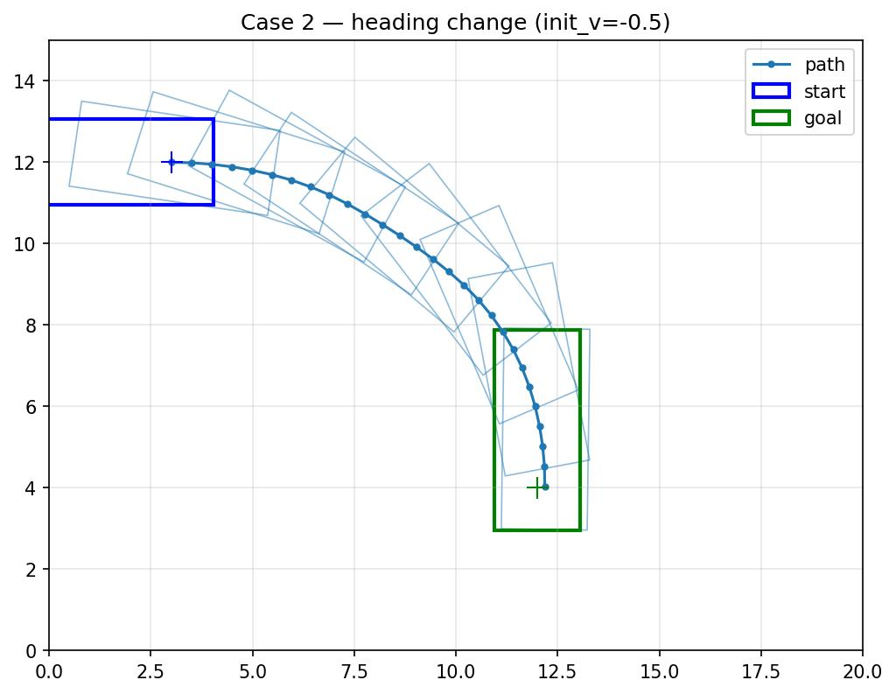

# Hybrid A Star Algorithm
This is a ROS-independent sub project of [PathPlanner](https://github.com/karlkurzer/path_planner.git)

## Prerequisite
* [Open Motion Planning Library (OMPL)](http://ompl.kavrakilab.org/)
* Python bindings: `pip install pybind11 numpy matplotlib`

## Setup
```
sudo apt install libompl-dev
```

## Build
```
mkdir build && cd build
cmake .. && make -j
./example
```

Python module is written to `build/python/hybrid_astar*.so`.

## Python / Notebook
```bash
# from repo root, with build/python on PYTHONPATH
cd build && cmake .. && make -j
jupyter notebook ../plan_once_test.ipynb
```
